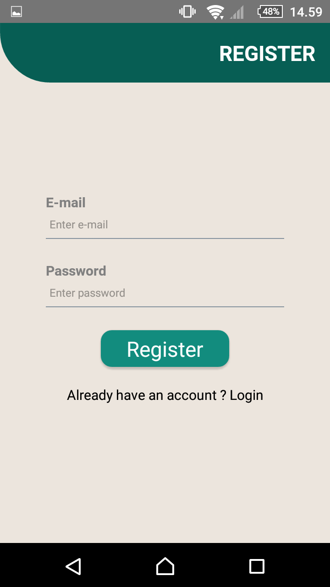
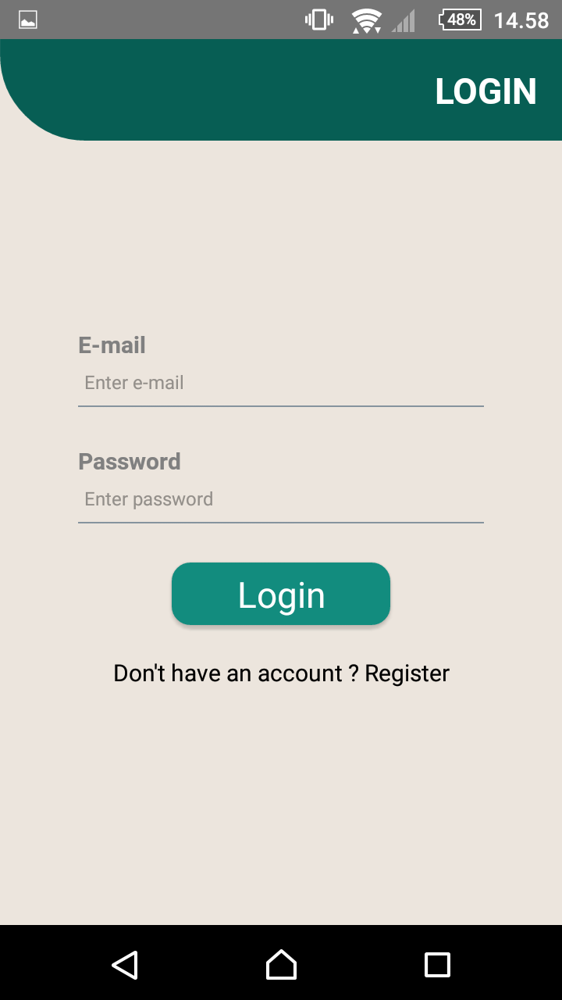
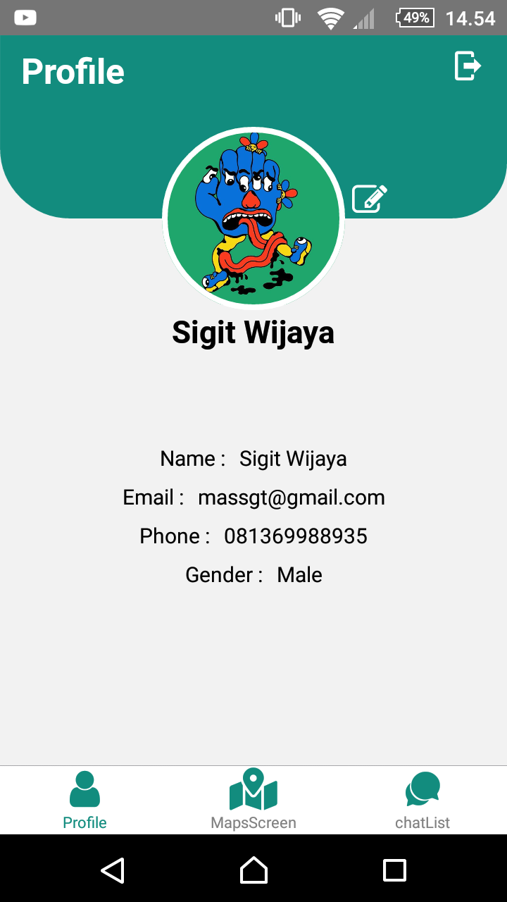
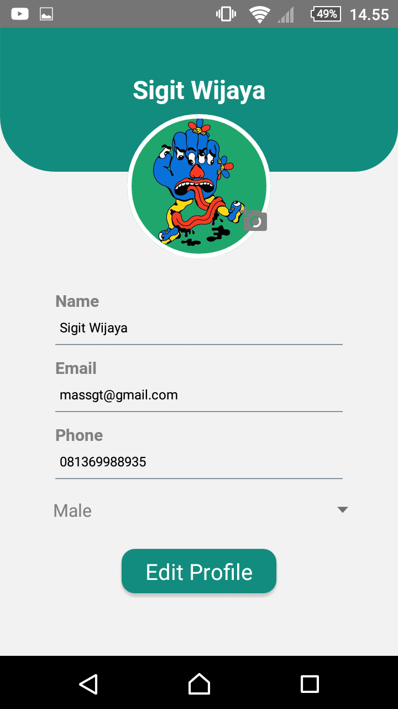
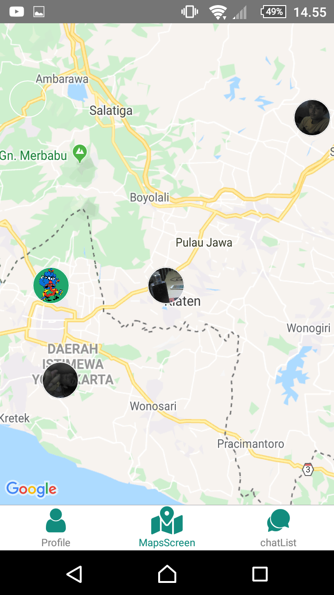
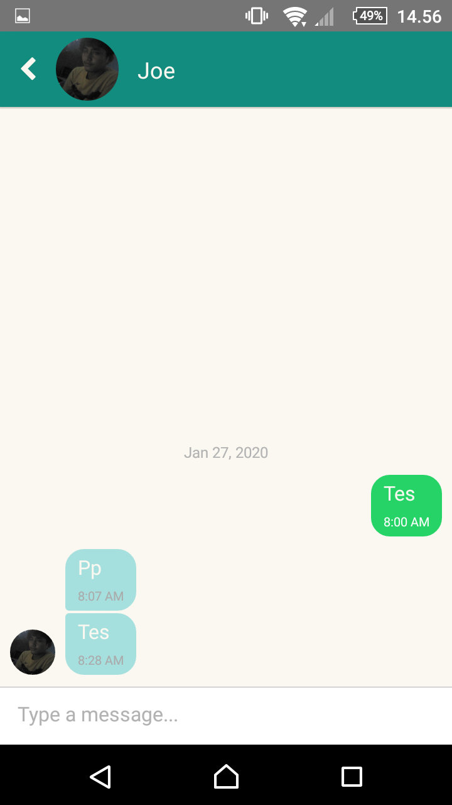
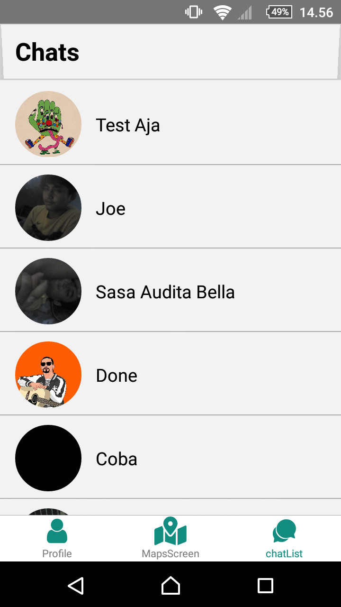

<h1 align="left">RealChat</h1>

## Table of Contents

- [Introduction](#introduction)
- [Features](#features)
- [Requirements](#requirements)
- [Screenshots](#screenshots)
- [Release APK](#release-apk)
- [Contributors](#contributors)

## Introduction
<b>RealChat!</b> is a chat application where we can chat with friends and can see the position of friends on maps.

  Built with <b>React Native</b> and integrated with <b>Firebase</b>.

## Features
* User can Register and Login with email and password
* User can manage their profile
* User can see another user profile
* User can chat with other user
* User can see other user location in maps

## Requirements
* [`Yarn`](https://yarnpkg.com/)
* [`react-native`](https://facebook.github.io/react-native/docs/getting-started)
* [`react-native-cli`](https://facebook.github.io/react-native/docs/getting-started)
* [`RealChat`](https://github.com/massgt/RealChat)

## Screenshots

    
    
    
    
    
    
    

## Release APK

## Contributors

  <table>
    <tr>
      <td align="center">
        <a href="https://github.com/massgt">
          <b>Sigit Wijaya Pramono</b>
        </a>
      </td>
    </tr>
  </table>

